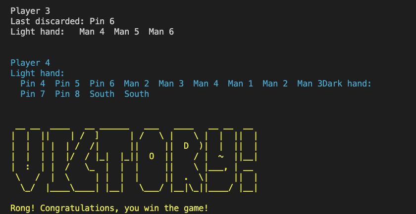

# Mahjong: OCaml Version

## Game Description

Riichi Mahjong (Japanese: 麻雀 or マージャン; mājan; Mandarin: 麻将; Cantonese: 蔴雀) is a traditional four-player board game in Asia. People play this grame with their friends or family members during holidays to connect with each other and to have fun. It is known for its rich 
hidden infomation and scoring rules (types of yaku).

## Running the Game

First, make sure you have OCaml 4.09.x and Ubuntu 18.04 or later for proper 
functionality and graphic display. Enter ``` sudo apt install fonts-emojione ``` to
support emoji representation of tiles.

Then, from the terminal, navigate into the folder 'Mahjong' and type the command
```
make play
```


A message like above should appear in your terminal. Follow the instruction and 
type
```
start
```
to start playing the game.

When you win the game, "victory" and the yaku you formed shows up:)


## Actions and commands

- **Discard a tile:** discard Man 1

- **Chii:** chii 1

- **Skip an action:** skip

- **make build:** builds everything in the app 

- **make test:** evaluates the test cases in src/test.ml.

- **make docs:** make docs generates documentation folders for the OCaml code: a doc.public for the exposed functions and a doc.private for helpers/unexposed functions.

Note: 
- our system riichi for the player and display to the tile(s) the player
are waiting automatically. 
- for more information on emoji representation of tiles, please see [here](https://www.htmlsymbol.com/unicode-code/mahjong-tiles/).


### Quick Note

- **Tile**: Similar to cards in Poker. There are a total of 136 tiles.

- **Wall tile**: Tiles that have not been drawn.

- **Hand tile**: Tiles held by players.

- **Discard tile**: Tiles discarded by players.

- **Yaku(役 or 役)**: Winning pattern. A player wins when their hand tiles form a winning pattern.

- **Chii (吃 or チー)**: Players can make an open-sequential-tiles, a sequence (3 consecutive tiles in the same suit), by calling “chii” using a tile discarded by the left player, who is the prior player.  This means every player can claim the left player’s discarded tile to make a sequence.

- **Riichi (立直 or リーチ)**: A player can declare Riichi if and only if the player needs exactly one more tile to have a winning pattern and has not Chii-ed in the game. After declaring Riichi, the player can only discard the tile they draw on that round. 


images: 



